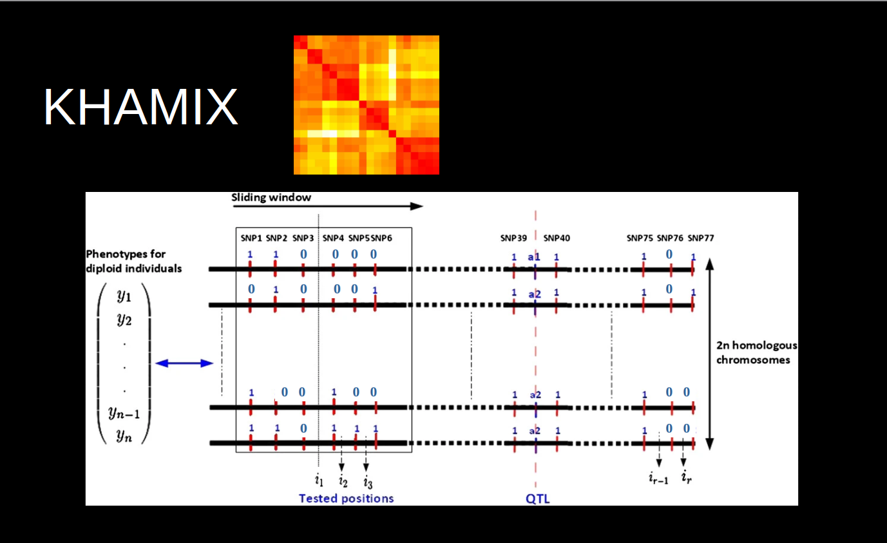
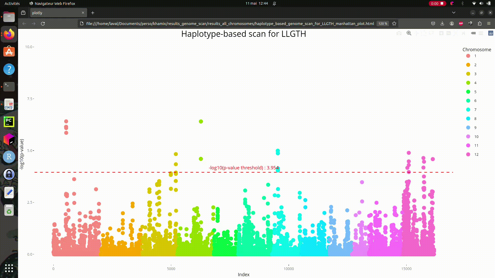
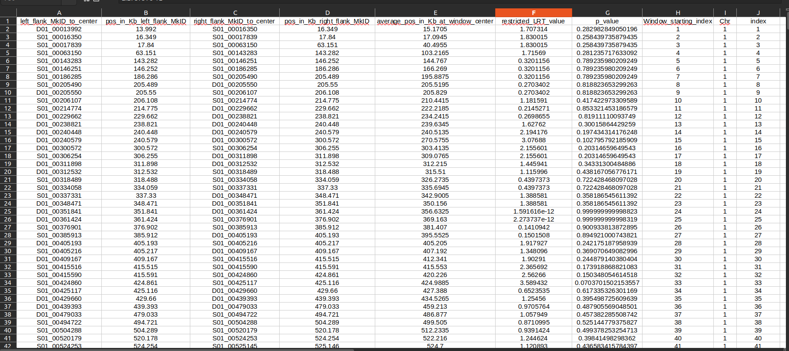
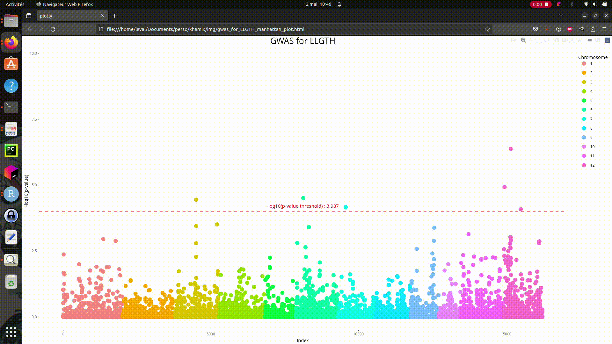
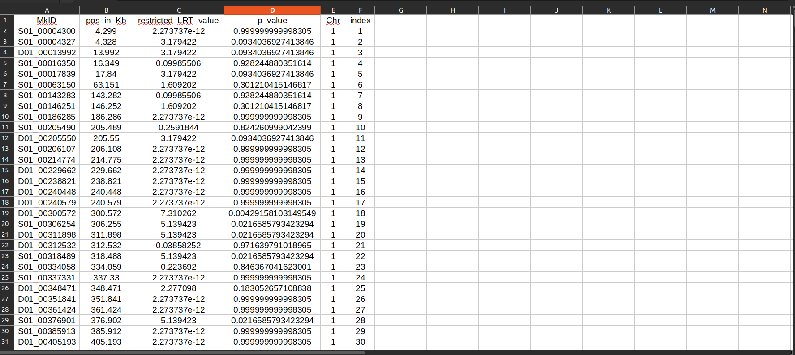
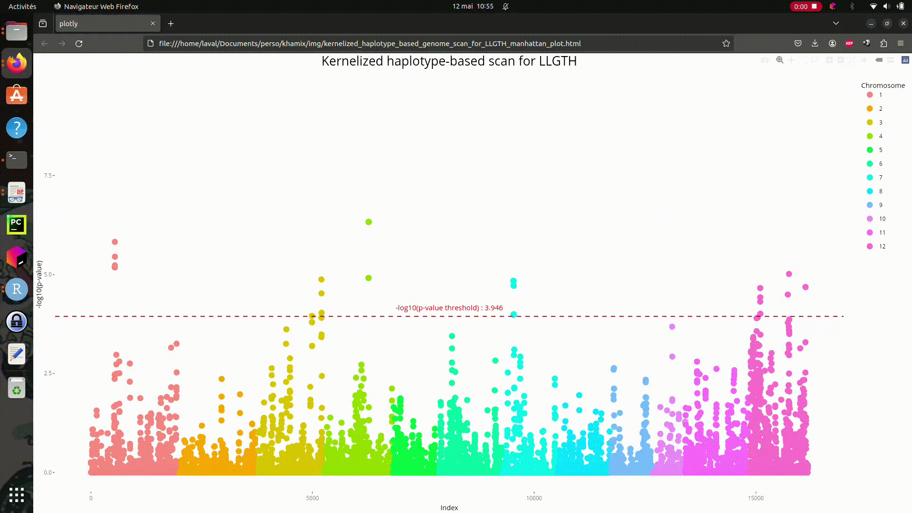
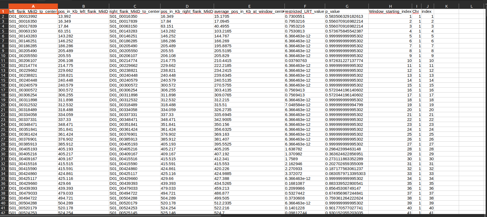
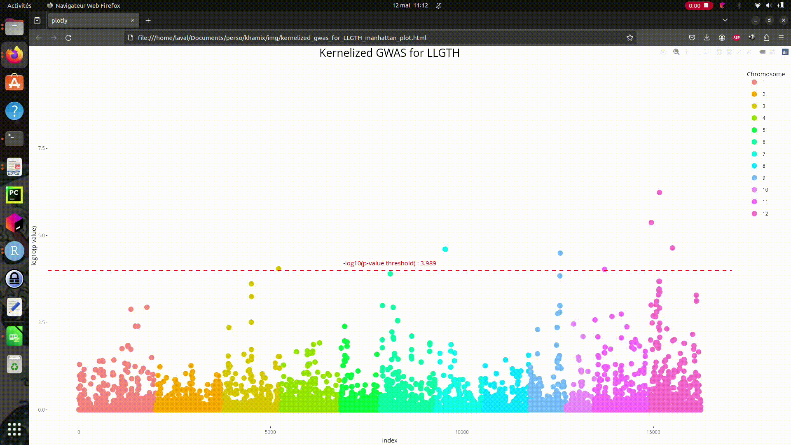
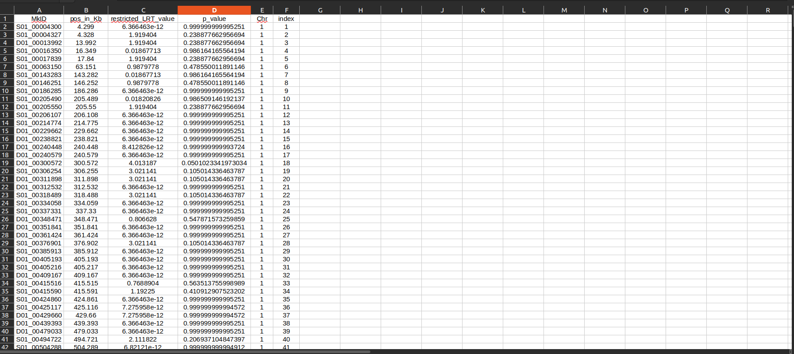

[]()

# Kernelized HAplotype-based MIXed model association mapping (KHAMIX) 

##### Licence, status and metrics
[](https://www.gnu.org/licenses/gpl-3.0)
[]()
[](https://www.repostatus.org/#active)


  

  

##### Languages and technologies
[](https://www.r-project.org/)
[](https://fr.wikipedia.org/wiki/Fortran)
[](https://en.wikipedia.org/wiki/Bash_(Unix_shell))
[](https://plotly.com/)
[](https://www.rstudio.com/)

## Objective, remarks and instructions :

### 🎯 Objective

* The ```KHAMIX``` software is designed to conduct a genome-wide scan for detecting quantitative trait loci (QTLs) and mapping them, utilizing a sliding window approach with $L > 1$ SNP markers along phased chromosomes. Consequently, each window encompasses $n_h$ haplotypes where $n_h \leq 2^L$. The central position of the sliding window is considered as the potential location harboring the putative QTL during the genome scan. As demonstrated in Jacquin $\textit{et al.}$ (2014), haplotypes harboring a QTL better capture the linkage disequilibrium (LD) with the latter than a neighbouring SNP, regardless of the degree of allelism at the QTL. This enhanced LD capture results in better detection, higher mapping accuracy, and possibly less spurious associations (i.e. false positives) over chromosomes due to local LD being captured by haplotypes.

* At the central position of the sliding window, ```KHAMIX``` evaluates and tests various mixed models and hypotheses, inspired by the works of Jacquin $\textit{et al.}$ (2014) and Lafarge $\textit{et al.}$ (2017). Particularly, the former study advocates the utilization of identity-by-state (IBS) of haplotypes for such analyses.  The software evaluates the following models and hypotheses for each window :
$$Y = X\beta + Z_hh+ Z_uu + \varepsilon \ (H_1)$$ 
$$versus$$
$$Y = X\beta + Z_uu + \varepsilon \ (H_0)$$
where :
  * $Y$ represents the vector of $n$ measured phenotypes for the analyzed trait.
  * $\beta$ denotes the vector of fixed effects.
  * $h$ represents the vector of random effects of haplotypes following a multivariate normal distribution, i.e. $h \sim N_{n_h}(0,H_{\sigma^2_{h}}) $, where $H=I_{n_h}$ is the covariance matrix describing the identity-by-state (IBS) status between haplotypes.
  * $u$ denotes the vector of random polygenic effects following a multivariate normal distribution, i.e. $u \sim N_{n}(0,K_{\sigma^2_{K}})$, where $K$ is the genomic covariance matrix also known as the Gram matrix. $K$ can be constructed using either the VanRaden (2008) method which represents a linear additive kernel, or a Gaussian kernel which is a non-linear universal approximator capable of modeling additive and epistatic effects (Jacquin $\textit{et al.}$, 2016).
  * $X$, $Z_h$, and $Z_u$ represent the design matrices that relate fixed and random effects to the measured phenotypes.
  * $\varepsilon$ denotes the vector of residuals.
  <p> </p>

  The exact distribution of the restricted likelihood ratio test (RLRT) under $H_0$ for these models is not known. However, it can be approximated by a sum of chi-squared distributions, specifically $\frac{1}{2}(\chi^2_{d_1 = 1} + \chi^2_{d_2 = 2} )$, as indicated by Self & Liang (1987) and Baey $\textit{et al.}$ (2021), provided the model assumptions are met. Significant deviations from these assumptions in practical scenarios, however, can lead to poor approximations. Therefore, ```KHAMIX``` uses maximum likelihood estimation (MLE) to infer $d_1$and $d_2$ based on the computed RLRT values under the null hypothesis $H_0$. Since these computed RLRT values are expected to closely follow the theoretical RLRT distribution under $H_0$, they provide a reliable basis for estimating $d_1$ and $d_2$ through MLE. Indeed, a very high majority of the RLRT values will conform to this distribution, making them effective for maximizing the likelihood function and accurately estimating the distribution parameters. Nevertheless, if the model assumptions are severely violated, the reliability of the MLE might be compromised.

### 🔍 Remarks 

* The KHAMIX software can only operate in a ```Unix/Linux``` environment, provided that ```R``` and its associated libraries are installed beforehand.

* Parallelization of computations launched by this software can only be achieved through a computing cluster and not on a personal computer.

* Sequential computation can also be performed on a personal computer, in a ```Unix/Linux``` environment, provided that ```R``` and its associated libraries are installed, but it is not recommended due to the long computation time.

* Sequential computation can be very time-consuming (one to several days) and is therefore not recommended if a computing cluster is available.

* On a computing cluster, the computation time for a complete genome scan (i.e. scanning all chromosomes by parallel computation) can vary from a few hours (2 to 3 hours on average) to a maximum of one day depending on the cluster's usage by other users (number of jobs/priorities, etc.).

### 💻 Instructions

* Download the ```khamix``` repository in the current user's directory on a computing cluster or personal computer using one of the following commands :

  *  ```git clone git@github.com:ljacquin/khamix.git``` <p> </p>
    or
  * ```git clone https://github.com/ljacquin/khamix.git``` 
  <p> </p>
  
  ⚠️ Make sure``` git``` is installed beforehand; if not, install it with ```sudo apt install git```.
  <p> </p>

* Given that ```R ≥ 4.1.2``` is already installed, use the following command to install ```khamix``` required ```R``` libraries : 

  * ```R -q --vanilla<requirements.R```
  <p> </p>

* If ```pandoc``` is not already installed on your ```Unix/Linux``` system, you can install it by executing the following command : 

  *  ```sudo apt install pandoc```
  <p> </p>

* Within the ```khamix``` folder, execute the following commands to make scripts and programs executable :

  *  ```chmod u+rwx make_scripts_programs_executable.sh```
  *  ```./make_scripts_programs_executable.sh```
  <p> </p>

* In the ```data_parameters``` folder, replace the following 6 files which serve as examples :  
    
    ```genotypes.txt```, ```incidence_fixed_effects.txt```, ```incidence_polygenic_effects.txt```, ```phased_genotypes.txt```,                  ```phenotypes.txt```, ```physical_map.txt```.

    ⚠️ Ensure that the new data files replacing the old ones adhere to the same format. In other words, headers and rows must be in the same format, i.e. ```GID```, ```MkID```, ```chr```, ```Pos```, etc., must be identical.
    
    ⚠️ If the files ```incidence_fixed_effects.txt``` and ```incidence_polygenic_effects.txt``` cannot be replaced prior to an analysis then they must be removed or deleted from the ```data_parameters``` folder. In this case, the fixed and polygenic design matrices will default to $X=1_n$ and $Z_u=I_n$ respectively.

* Prior to initiating an analysis, execute the command ```./clean_scans.sh``` within the ```khamix``` folder to clear any existing directories of the type ```genome_scan_chromo_num_*```.

    ⚠️ It is crucial to avoid running the command``` ./clean_scans.sh``` after completing a full genome analysis, as it will permanently erase all results.

* Open the main script by typing ```gedit khamix.sh &```, or alternatively ```nano khamix.sh &``` if gedit is not installed, to modify the file. At the beginning of the script, modify the following 6 parameters according to the desired analysis :

  * ```trait_name``` corresponds to the trait under analysis.
  * ```nb_snp_hap``` denotes the size of the sliding window (i.e. size of haplotypes) in terms of the number of markers. According to several studies, it is generally advised to use ```nb_snp_hap = 6``` for a marker density of at least 20K in order to achieve optimal mapping accuracy (Lafarge $\textit{et al.}$, 2017; Jacquin $\textit{et al.}$, 2014; Calus $\textit{et al.}$, 2009; Grapes $\textit{et al.}$, 2005). 
  * ```nb_chromosomes``` denotes the total number of chromosomes for the analyzed data set.
  * ```kernel_index``` denotes the type of kernel (i.e. VanRaden or Gaussian) used to build the genomic covariance matrix $K$. 
  * ```signif_level``` corresponds to the significance level for the restricted likelihood ratio test (RLRT).
  * ```local_or_cluster``` corresponds to the type of computation, i.e. local computation or parallelized computation on a cluster. Please note that depending on the cluster configuration, you may need to make adjustments within the ```khamix.sh``` script for parallelized computation. Specifically, you may need to comment out either the ```qsub``` or ```sbatch``` command based on the cluster requirements.
  <p> </p>
  
* To start the genome scan for the analyzed trait, simply execute the command ```./khamix.sh```. Note that the script's outputs can be redirected using the command ```./khamix.sh > khamix_outputs```.

* To monitor the progress of parallel jobs, use the command ```qstat -u username``` (or equivalent depending on the cluster configuration).

* Upon completion of the jobs, execute the command ```./get_results_scans.sh``` to retrieve all results, including RLRT graphs per chromosome, significant regions/windows with corresponding haplotypes per chromosome, etc.

  ⚠️ The significance level of results can be modified through the ```get_results_scans.sh``` script, as many times as necessary, before each run of the command ```./get_results_scans.sh```. To do so, change the ```modify_signif_level``` and ```new_signif_level``` parameters within the script. Keep in mind that the ```results_genome_scan``` folder will be cleared each time, so make sure to save previous results if necessary.

* Final note: The ```khamix``` folder can be duplicated multiple times, with each copy renamed, to analyze multiple traits in parallel. For example, folders like ```khamix_LLGTH```, ```khamix_NBL```, ```khamix_TIL```, etc., can be created from the provided data set.

## Result examples :

The gif and captured images below show result examples, for ```LLGTH``` using the example dataset, that one might expect with ```khamix```:

### Haplotype association analysis:



[]()

### Single-marker association analysis (i.e. GWAS):



[]()

### Kernelized haplotype association analysis:



[]()

### Kernelized single-marker association analysis (i.e. Kernelized GWAS):



[]()

## References :

* Charlotte Baey, Paul-Henry P.-H. Cournède, Estelle Kuhn. Asymptotic distribution of likelihood ratio test statistics for variance components in nonlinear mixed effects models. Computational Statistics and Data Analysis, 2019, 135, pp.107-122. 10.1016/j.csda.2019.01.014. hal-02367731

* Lafarge T., Bueno C., Frouin J., Jacquin L., Courtois B., Ahmadi N. (2017). Genome-wide association analysis for heat tolerance at flowering
detected a large set of genes involvedin adaptation to thermal and other stresses.

* Jacquin, L., Elsen, JM. & Gilbert, H. Using haplotypes for the prediction of allelic identity to fine-map QTL: characterization and properties. Genet Sel Evol 46, 45 (2014). https://doi.org/10.1186/1297-9686-46-45

* Jacquin L, Cao T-V and Ahmadi N (2016) A Unified and Comprehensible View of Parametric and Kernel Methods for Genomic Prediction with Application to Rice. Front. Genet. 7:145. doi: 10.3389/fgene.2016.00145

* VanRaden, P.M. (2008) Efficient Methods to Compute Genomic Predictions. Journal of Dairy Science, 91:4414-4423. 

* Calus MPL, Meuwissen THE, Windig JJ, Knol EF, Schrooten C, Vereijken ALJ, Veerkamp RF: Effects of the number of markers per haplotype and clustering of haplotypes on the accuracy of QTL mapping and prediction of genomic breeding values. Genet Sel Evol. 2009, 41: 11-10.1186/1297-9686-41-11.

* Grapes L, Firat MZ, Dekkers JCM, Rothschild MF, Fernando RL: Optimal haplotype structure for linkage disequilibrium-based fine mapping of quantitative trait loci using identity by descent. Genetics. 2005, 172: 1955-1965. 10.1534/genetics.105.048686.

* Self S G and Liang K Y. Asymptotic properties of maximum likelihood estimators and likelihood ratio tests under nonstandard conditions. J Amer Statist Assoc, 82 :605–610, 1987.


